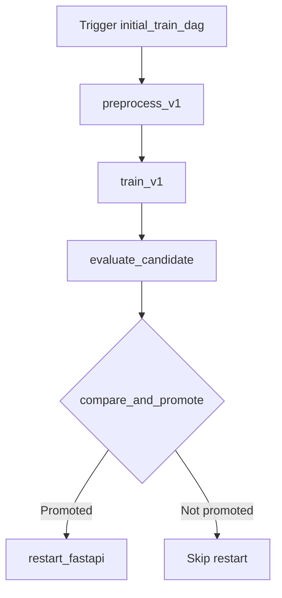
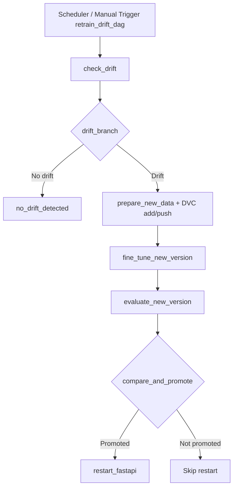

# **Data Set Management**

# Quick start for orchestration flow

```
cp .env.example .env
docker compose build airflow fastapi mlflow
docker compose up -d
```

# DAG smoke check (import parse)

```
docker compose run --rm airflow-scheduler python -c "from airflow.models import DagBag; b=DagBag('/opt/airflow/dags', include_examples=False); print('import_errors=', b.import_errors); raise SystemExit(1 if b.import_errors else 0)"
```

# Trigger examples

```
docker compose exec airflow-scheduler airflow dags trigger initial_train_dag
docker compose exec airflow-scheduler airflow dags trigger retrain_drift_dag
```

# Training / Retraining Process

## 1) Initial Training Pipeline (`initial_train_dag`)

Pipeline นี้ใช้สำหรับ train ครั้งแรก (หรือรันใหม่แบบ manual) และ promote model เข้า MLflow Registry

Flow ที่เกิดขึ้น:

- `preprocess_v1`: เตรียม `data/v1` จาก `mockData` (ถ้า `data/v1/train` และ `data/v1/val` มีอยู่แล้วจะ skip)
- `train_v1`: train model และ log run/model artifact เข้า MLflow
- `evaluate_candidate`: ประเมิน candidate model บน latest test dataset
- `compare_and_promote`: เทียบ candidate กับ Production model ปัจจุบัน
  - ถ้าไม่มี Production model เดิม จะ promote ได้เลย
  - ถ้ามีอยู่แล้ว จะ promote เฉพาะเมื่อ candidate ดีกว่าหรือเท่ากับ baseline
- `restart_fastapi`: restart FastAPI container และเช็ก `/health`



## 2) Retraining Pipeline (`retrain_drift_dag`)

Pipeline นี้สำหรับ retrain อัตโนมัติแบบ scheduled โดยมี drift เป็นเงื่อนไข

Flow ที่เกิดขึ้น:

- `check_drift`: ตรวจ drift จาก latest version dataset เทียบกับ `mockData`
- `drift_branch`: branch ตามผล drift
  - ไม่เกิด drift -> `no_drift_detected` (จบ flow)
  - เกิด drift -> ไปต่อที่ `prepare_new_data`
- `prepare_new_data`:
  - สร้าง dataset version ใหม่จาก latest data ด้วย Reservoir Sampling (70%)
  - split ใหม่เป็น 80:10:10 (train/val/test)
  - `dvc add` และ `dvc push -r s3remote`
- `fine_tune_new_version`: finetune จาก `models:/googlenet-thai-food/Production`
- `evaluate_new_version`: evaluate candidate model
- `compare_and_promote`: promote เฉพาะเมื่อ candidate ดีกว่าหรือเท่ากับ Production
- `restart_fastapi`: restart FastAPI ถ้ามีการ promote



## Runtime Notes

- ถ้า `prepare_new_data` ล้มที่ `dvc add` ให้เช็กว่า Airflow มองเห็น `.git` ใน `/opt/airflow`
- ถ้า `prepare_new_data` ล้มที่ `dvc push` ให้เช็ก AWS credentials ใน `secrets/.env`
- MLflow UI ของเครื่องนี้เปิดที่ `http://localhost:5001` (host port map เป็น `5001:5000`)

# When add new data set

```
dvc add data/v2
git commit -m "add v2"
dvc push
```

# When pull and use

```
git clone ...
```

# **add env file to secrets folder**

- Install (Ensure it's installed)

- **Only First Time You clone project**

```
python -m venv .venv
```

- Activate and install

```
.venv\Scripts\activate
pip install "dvc[s3]"
pip install dotenv-cli
dotenv -e ./secrets/.env run dvc pull

pip install python-dotenv
python -m dotenv -f secrets/.env run dvc pull
```

# How to initalize in case add new dvc

- **Only First Time of Initialize**

```
dvc init
git commit -m "init dvc"
```

- Add what you want ex. data/v1

```
dvc add data/v1
```

- then commit

```
git add .
git commit -m "track datasets"
```

- Google Drive folder **Only First Time of Initialize** copy the url (stil bug) https://drive.google.com/drive/folders/XXXXXXXX

```
dvc remote add -d gdrive gdrive://FOLDER_ID
dvc remote modify gdrive gdrive_use_service_account true
dvc remote modify gdrive gdrive_service_account_json_file_path secrets/XXX.json
```

- S3 bucket **Only First Time of Initialize** copy the url

```
dvc remote add -d s3remote s3://bucketname/dvcstore
dvc remote list
```

```
dvc push
```

# Push to GIthub

```
git push origin
```

# Other

```
Get-Content ./secrets/.env | ForEach-Object {
if ($_ -match "=") {
    $name, $value = $_ -split "=",2
    Set-Item -Path env:$name -Value $value
}
}
```

# Directory Prefer now (Th food 50 is now avaliable)

Th food 50

```
data/
 ├── test/ (No longer use)
 │    └── BitterMelon/
 │
 ├── v1/
 │    ├── train/
 │    			└── BitterMelon/
 │    └── val/
 │    └── test/
 │
 └── v2/
      ├── train/
      └── val/
      └── test/
```

Th food 100

```
data/
 ├── test_fixed/ (สังดึงมาเก็บก่อนเลย)
 │    ├── 0/
 │    ├── 1/..
 │
 ├── v1/
 │    ├── 0/
 │    ├── 1/..
 │
 │
 │
 └── v2/
 │    ├── 0/
 │    ├── 1/..
```
